# ATTO - A Simple Launcher     &ensp;    
Atto is a custom launcher app for users who wants to organize apps 
easily and manages phone usage time 

## Add a Label for Apps

  * Classify apps into groups with label automatically
  * Several wallpapers for choose

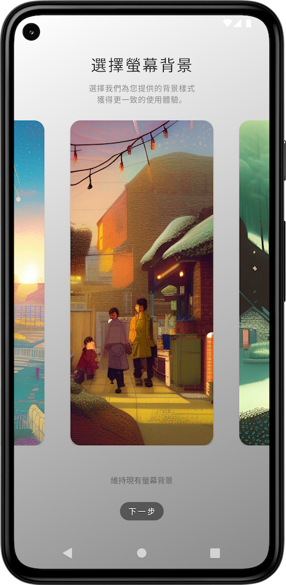 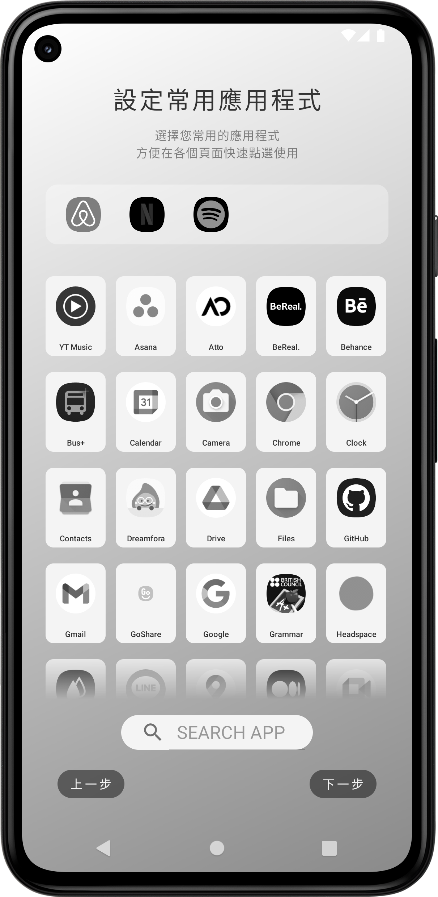 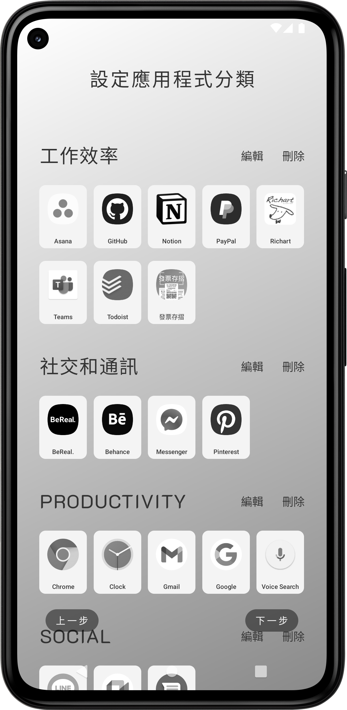 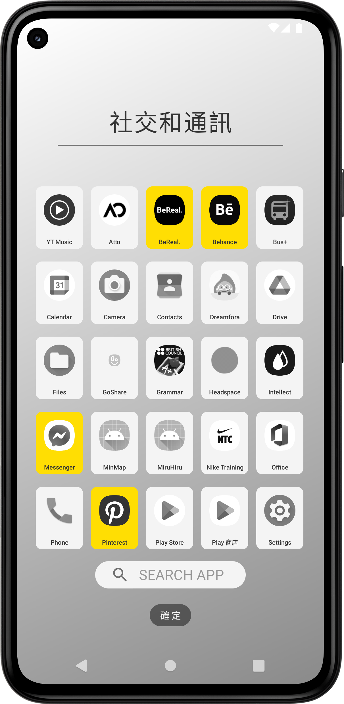

&nbsp;
## Simple style Desktop

  * Quick navigate slide drawer 
  * Highlight app background with different color
  * Support Notification and widgets

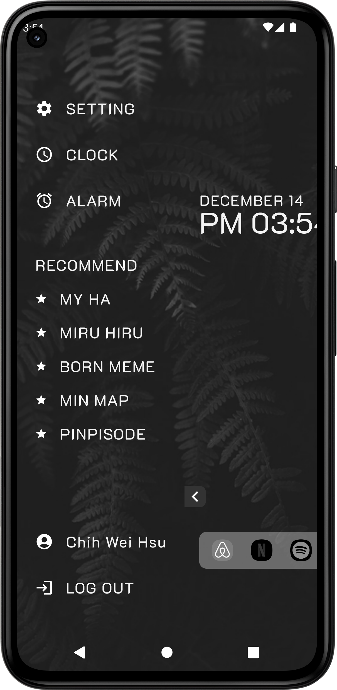 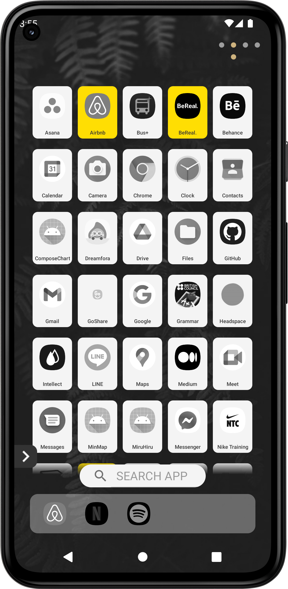 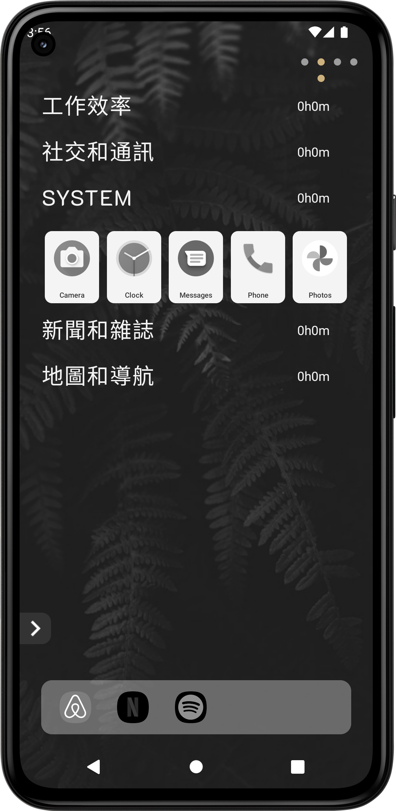 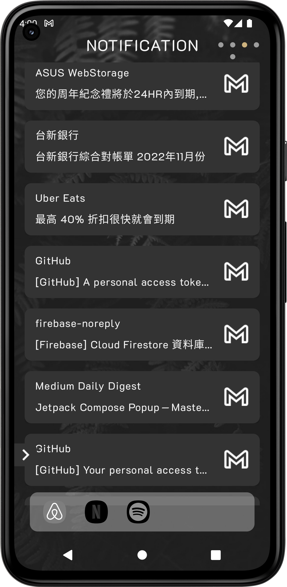

&nbsp;
## Control Usage Time
  * Know how long the app you use quikly
  * Limit usage time by yourself or Pomodoro mode

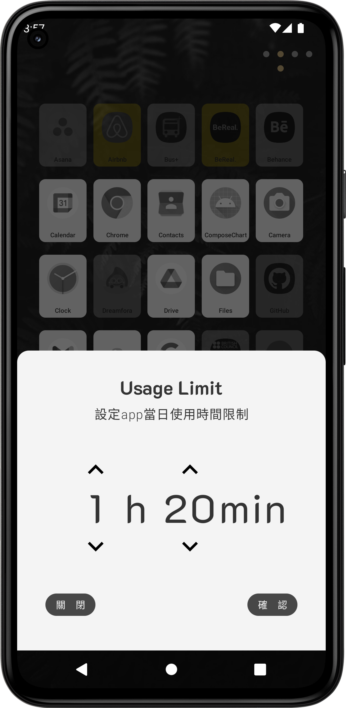 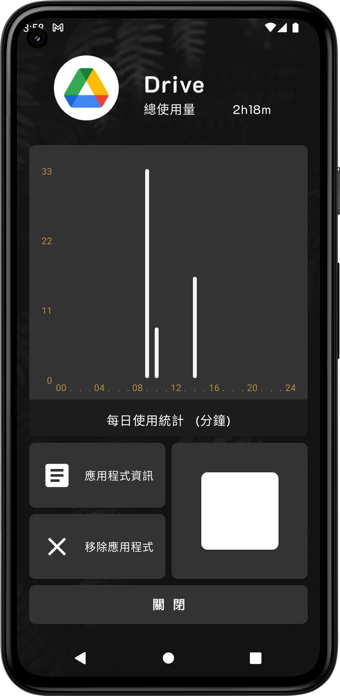 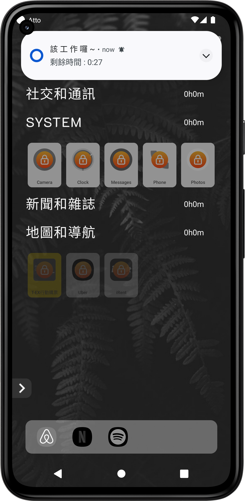 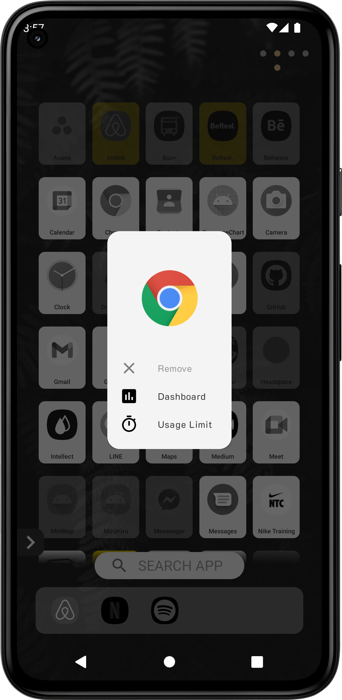
 

&nbsp;
## Set Reminder
  * Support Alarm , Todo list and POMODORO

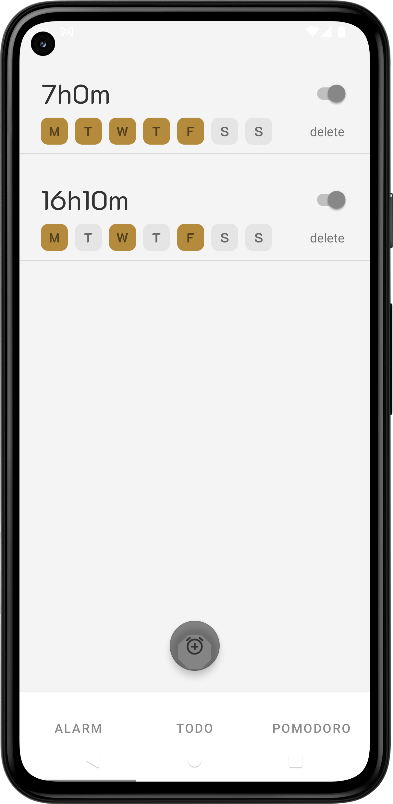 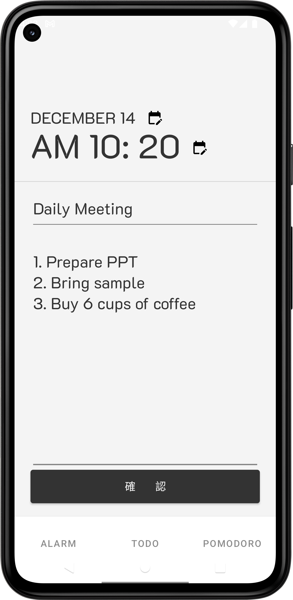 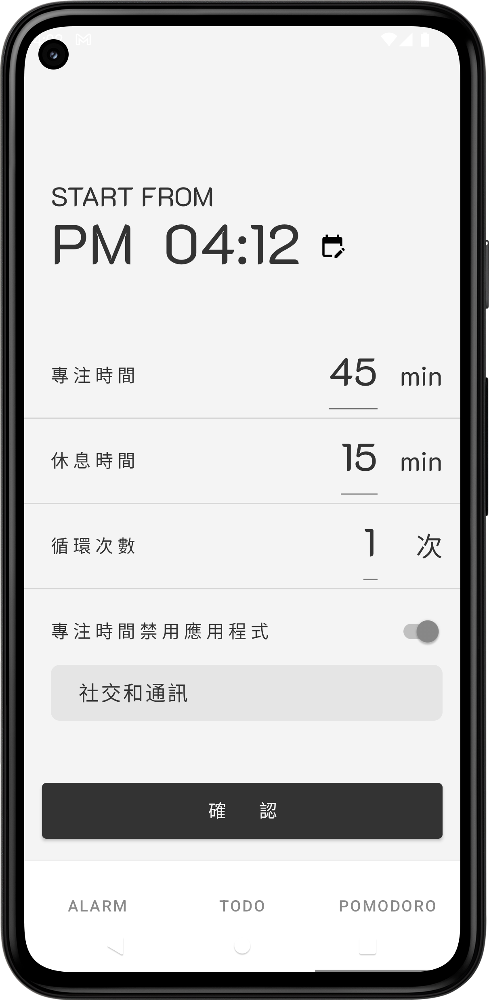 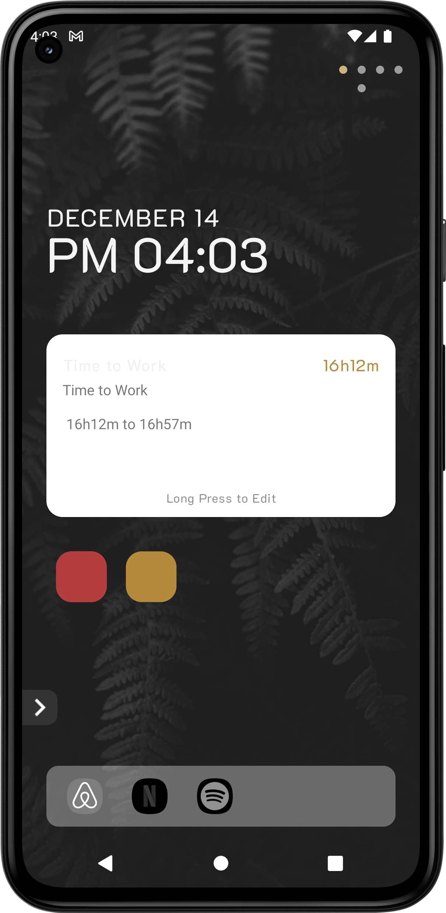

&nbsp;
## Technical Highlights

* Structured code with **MVVM** pattern to reduce coupling and improve readability
* Obtained system data and stored in Room as local data and synced to **Firebase** when user login.
* Implemented **Repository Pattern** to handle different data sources and organize Model layer and 
  keep the functions easily to use
* Calculated apps usage time by **UsageStatsManager** and displayed on UI, based on this statistic 
  developed a usage limit feature and combined it with Pomodoro
* Used **WorkManager** to reset uage limit timer every midnight
* Used **AlarmManager** to remind user in correct time
* Implemented **NotificationListenerService** to receive the device notification messages 
* Used **WidgetManager** to support system widget
* Added **GestureDetector** to achieve more ways to UI control
* Designed special drawer by using **MotionLayout**
* Showed user statistic in visualize by williamchart
* Supported multiple time zone feature    

  

&nbsp;
## Version History

| Version |   Description   |
| :--: | :------------------------------|
| 1.0.7 | Fix drawer slide and viewpager conflict bug          |
| 1.0.5 | Release version          |
| 1.0.3 | Implemented alarm and usage features         |
| 1.0.2 | Basic tutorial and setting feature         |
| 1.0.1 | Initial version           |

&nbsp;
## Requirements

* Android SDK 26
* Gradle 7.2

&nbsp;
## Contact

E-Mail : chihweih27@gmail.com 
 Linkedin : www.linkedin.com/in/chih-hsu

